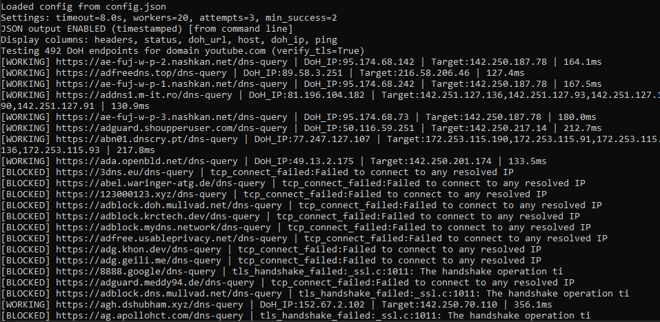

# 🔒 DoH-Tester

🇺🇸 [English](README.md) | 🇷🇺 [Русский](README-RU.md) | 🇨🇳 [中文](README-ZH.md) | 🇮🇷 [فارسی](README-FA.md)

[](https://www.python.org/downloads/)
[](https://opensource.org/licenses/MIT)
[](https://github.com/psf/black)

Высокопроизводительный многопоточный инструмент для тестирования DNS-over-HTTPS (DoH) эндпоинтов с интеллектуальным определением протоколов, настраиваемой фильтрацией и автоматическим управлением списками.

## 📋 Введение

DoH-Tester проверяет DoH‑эндпоинты в большом масштабе, тестируя TCP‑соединение, TLS‑рукопожатие и фактическое разрешение DNS по нескольким протоколам (Wire‑формат GET/POST, JSON API). Инструмент предназначен для сетевых администраторов, защитников приватности и разработчиков, которым необходимо поддерживать надёжное и нецензурируемое DNS‑разрешение в враждебных сетевых средах.

---

### Ключевые возможности

* ✅ Тестирование TCP‑соединения (IPv4 и IPv6)
* 🔐 Проверка TLS‑рукопожатия (опциональный небезопасный режим)
* 🌐 Разрешение DNS через:

  * DoH GET (wire‑формат)
  * DoH POST (wire‑формат)
  * DoH GET (JSON API)
* ⚡ Параллельное тестирование с использованием пулов потоков
* 🧠 Интеллектуальная классификация (WORKING / FLAKY / BLOCKED)
* 📊 Измерение задержки (мс)
* 🧾 Табличный вывод, удобный для чтения
* 🧹 Режим чистого вывода (только URL)
* 📦 Опциональный вывод в JSON (с авто‑таймстампом или пользовательским именем)
* 📁 Настройка через `config.json`
* 🗂 Опциональная автоматическая очистка рабочих эндпоинтов из исходного файла

---

## 🎯 Сценарии использования

| Сценарий                               | Как помогает DoH-Tester                                                                                                |
| -------------------------------------- | ---------------------------------------------------------------------------------------------------------------------- |
| **Обход цензуры**                      | Быстро определяет, какие DoH‑резолверы реально работают для обхода DNS‑блокировок и доступа к фильтрованным платформам |
| **Поддержка инструментов приватности** | Формирование надёжных списков DoH для VPN, прокси, туннелей или конфигураций браузеров                                 |
| **Оптимизация производительности**     | Измерение задержек для выбора самого быстрого резолвера в вашем регионе                                                |
| **Аудит сети**                         | Проверка DoH‑инфраструктуры в корпоративных сетях и сетях провайдеров                                                  |
| **Мониторинг инфраструктуры**          | Автоматизированные проверки состояния частных DoH‑серверов                                                             |

<details>
<summary><b>🔓 Обход цензуры (нажмите, чтобы раскрыть)</b></summary>

Подключайтесь к заблокированным платформам, таким как YouTube, Instagram, Twitter/X и новостные сайты, разрешая их домены через зашифрованные HTTPS‑соединения и обходя DNS‑фильтрацию и DNS‑подмену. [gfw resist HTTPS proxy](https://github.com/GFW-knocker/gfw_resist_HTTPS_proxy)

**Как это работает:**

* Стандартные DNS‑запросы (UDP порт 53) не шифруются и легко перехватываются межсетевыми экранами
* DoH инкапсулирует DNS‑запросы в HTTPS‑трафик (порт 443), делая их неотличимыми от обычного веб‑серфинга
* Полезно в сильно цензурируемых сетях, где:

  * Стандартный DNS отравлен (возвращает неверные IP‑адреса)
  * Доменные имена блокируются на уровне DNS‑резолвера
  * Применяется фильтрация по SNI, но шифрование DNS ещё не заблокировано

**Важное примечание:** например, если VPN‑сервисы или IP‑адреса Cloudflare заблокированы на **IP‑уровне** (фаервол отбрасывает пакеты к этим IP), одного DoH недостаточно для восстановления доступа к этим конкретным IP. Однако DoH может помочь вам:

1. Найти альтернативные рабочие эндпоинты, которые ещё не заблокированы
2. Разрешить доменные имена VPN в IP‑адреса (если заблокирован только DNS, а не сами IP)
3. Получить доступ к «domain‑fronted» или альтернативным CDN‑эндпоинтам, которые не заблокированы по IP

</details>

<details>
<summary><b>🔐 Поддержка инструментов приватности (нажмите, чтобы раскрыть)</b></summary>

Поддерживайте доступ к вашей инфраструктуре приватности, когда стандартные механизмы обнаружения не работают:

* **Доступ к заблокированным VPN‑доменам:** если домен вашего VPN‑провайдера (например, `vpn-provider.com`) заблокирован через DNS‑подмену, но сами серверы не заблокированы по IP, используйте рабочие DoH‑эндпоинты для получения реальных адресов серверов и сохранения соединения.

* **DNS‑туннелирование:** используйте проверенные рабочие DoH‑эндпоинты как транспортный уровень для инструментов DNS‑туннелирования, таких как:

  * [dnstt](https://www.bamsoftware.com/software/dnstt/) — TCP‑over‑DNS туннель, работающий через DoH‑резолверы
  * [DNSCrypt-proxy](https://github.com/DNSCrypt/dnscrypt-proxy) — может работать через DoH с анонимизированными релеями
  * [Iodine](https://github.com/yarrick/iodine) — IP‑over‑DNS туннелирование (требует UDP, но может использовать DoH для начальной загрузки)

* **Инструменты обхода блокировок на этапе инициализации:** многие антицензурные инструменты (Tor‑мосты, Shadowsocks, WireGuard) сначала должны разрешить домен bootstrap‑сервера. Если этот DNS‑запрос отравлен, инструмент не сможет подключиться. Предварительное разрешение через DoH предоставляет корректные IP‑адреса для запуска таких инструментов.

</details>

<details>
<summary><b>⚡ Оптимизация производительности (нажмите, чтобы раскрыть)</b></summary>

Найдите оптимальный резолвер для ваших сетевых условий:

* Измерение задержек до нескольких DoH‑эндпоинтов одновременно
* Определение географической оптимизации маршрутизации (некоторые провайдеры направляют трафик к ближайшим PoP)
* Сравнение скорости разрешения между wire‑форматом и JSON API
* Создание списков резолверов с учётом местоположения и автоматическим выбором самого быстрого варианта

</details>

<details>
<summary><b>🏢 Аудит сети (нажмите, чтобы раскрыть)</b></summary>

Проверка доступности и соответствия DoH‑инфраструктуры:

* Тестирование доступности публичных DoH‑резолверов из корпоративных сетей
* Проверка корректной работы частных/внутренних DoH‑серверов
* Обнаружение перехвата TLS (middlebox‑устройств, нарушающих DoH‑соединения)
* Генерация отчётов о соответствии требованиям, показывающих уровень DNS‑приватности в сегментах сети

</details>

## ✨ Полный список функций

<details>
<summary><strong>🔍 Основные возможности тестирования</strong></summary>

* **Поддержка DoH‑протоколов**: DNS wire‑формат по RFC 8484 через GET и POST, а также JSON API (совместимо с Google / Cloudflare)
* **Многоуровневая проверка**: TCP‑соединение → TLS‑рукопожатие → DoH‑разрешение на уровне приложения
* **Интеллектуальное определение протокола**: автоматическое тестирование wire‑формата и JSON API при возможности
* **Двухстековая сеть**: поддержка IPv4 и IPv6 с автоматическим откатом
* **Безопасное для провайдера тестирование**: выполняет реальное DNS‑разрешение без вызова DNS‑загрязнения или фильтрации

</details>

<details>
<summary><strong>⚡ Производительность и надёжность</strong></summary>

* **Параллельный движок тестирования**: настраиваемый пул потоков для высокоскоростного тестирования эндпоинтов
* **Устойчивый механизм повторов**: несколько попыток для каждого эндпоинта с настраиваемыми порогами успеха
* **Измерение задержек**: высокоточное измерение времени каждого запроса в миллисекундах
* **Безопасный выход по Ctrl+C**: корректное завершение с сохранением частичных результатов
* **Интеллектуальная классификация**: эндпоинты помечаются как **WORKING**, **FLAKY** или **BLOCKED**

</details>

<details>
<summary><strong>🔐 Безопасность и диагностика</strong></summary>

* **Проверка TLS**: валидация сертификатов и рукопожатия с опциональным небезопасным режимом
* **Анализ сертификатов**: сбор информации о субъекте TLS‑сертификата и параметрах шифра
* **Классификация ошибок**: различение TCP‑блокировок, TLS‑перехвата и ошибок DoH на уровне приложения
* **Отчёт о разрешённых IP**: отображение фактических результатов DNS‑разрешения для проверки

</details>

<details>
<summary><strong>📊 Вывод и отчётность</strong></summary>

* **Гибкие форматы вывода**:

  * Таблицы, удобные для чтения
  * Чистые списки URL (удобно для скриптов)
  * Машиночитаемый JSON
* **Вывод с таймстампами**: автоматические метки времени ISO 8601 (или пользовательские имена файлов)
* **Сортировка результатов**: JSON‑вывод сортируется по задержке (самые быстрые — первыми)
* **Фильтрация только рабочих**: возможность отображать или экспортировать только рабочие эндпоинты

</details>

<details>
<summary><strong>🗂 Управление списками и файлами</strong></summary>

* **Режим автоматической очистки**: удаление рабочих эндпоинтов из исходного списка
* **Защита резервными копиями**: создание файлов `.backup` перед изменением входных данных
* **Сохранение комментариев**: сохранение комментариев и форматирования в списках эндпоинтов
* **Самовосстанавливающиеся списки**: помогает поддерживать свежие и надёжные коллекции DoH‑эндпоинтов

</details>

<details>
<summary><strong>🧠 Конфигурация и удобство использования</strong></summary>

* **Полная настраиваемость**: все значения по умолчанию управляются через `config.json`
* **Гибкие таймауты и лимиты**: тонкая настройка повторов, потоков и порогов
* **Режим чистого вывода**: минимальный вывод для автоматизации и shell‑конвейеров

</details>

## 🚀 Установка

### Требования

* [Python](http://python.org/downloads/) **3.8+** (рекомендуется)

### Клонирование или загрузка

```bash
git clone https://github.com/BLACKGAMER1221/doh_tester.git
cd doh_tester
```
Вы также можете скачать Windows-exe файл со [страницы релизов](https://github.com/BLACKGAMER1221/doh_tester/releases)

### Установка зависимостей

```bash
pip install requests dnspython
```

# Проверка установки

```bash
python test_doh.py --help
```

## Использование и команды

### Базовое использование

```bash
python test_doh.py <домен> [параметры]
```

### Аргументы командной строки

| Аргумент            | По умолчанию    | Описание                                                |
| ------------------- | --------------- | ------------------------------------------------------- |
| `domain`            | (обязательно)   | Домен для разрешения (например, `example.com`)          |
| `--config`          | `config.json`   | Путь к файлу конфигурации                               |
| `--doh-file`        | `doh.txt`       | Путь к файлу со списком DoH‑URL                         |
| `--timeout`         | `8.0`           | Таймаут на операцию в секундах                          |
| `--workers`         | `20`            | Количество параллельных потоков                         |
| `--attempts`        | `3`             | Количество попыток DNS‑запроса на эндпоинт              |
| `--min-success`     | `2`             | Минимум успешных ответов для статуса WORKING            |
| `--insecure`        | `False`         | Пропустить проверку TLS‑сертификатов                    |
| `--output`          | (с таймстампом) | Путь к выходному файлу                                  |
| `--working-only`    | `False`         | Показывать только WORKING‑результаты                    |
| `--no-working-only` | -               | Показывать все результаты (переопределяет конфиг)       |
| `--clean-output`    | `False`         | Выводить только рабочие URL (по одному в строке)        |
| `--json-output`     | `False`         | Записать JSON‑вывод (авто‑таймстамп или указанный путь) |

### Примеры использования

#### Базовый тест

```bash
python test_doh.py example.com
```

#### Показать только рабочие эндпоинты

```bash
python test_doh.py example.com --working-only
```

#### Чистый вывод (только список URL)

```bash
python test_doh.py example.com --clean-output
```

#### Пользовательская конфигурация

```bash
python test_doh.py example.com \
  --doh-file my_doh_list.txt \
  --timeout 10 \
  --workers 30 \
  --attempts 5 \
  --min-success 3
```

#### JSON‑вывод

```bash
# JSON‑файл с авто‑таймстампом
python test_doh.py example.com --json-output

# Указание имени JSON‑файла
python test_doh.py example.com --json-output results.json
```

#### Тестирование приватного DoH (самоподписанные сертификаты)

```bash
python test_doh.py internal.domain --insecure
```

#### Комбинированные параметры

```bash
python test_doh.py example.com --working-only --clean-output --json-output --output results.txt
```

---

## Файл конфигурации

Инструмент использует JSON‑файл конфигурации (`config.json` по умолчанию) для управления всеми параметрами по умолчанию.

### Конфигурация по умолчанию

```json
{
  "doh_file": "doh.txt",
  "output_file": "",
  "timeout": 8.0,
  "workers": 20,
  "attempts": 3,
  "min_success": 2,
  "remove_working_from_doh_file": false,
  "working_only": false,
  "json_output": false,
  "show_headers": true,
  "show_status": true,
  "show_doh_url": true,
  "show_host": true,
  "show_doh_ip": true,
  "show_target_ip": false,
  "show_ping": true
}
```

### Параметры конфигурации

#### Настройки файлов и вывода

| Параметр      | Тип    | Описание                                         |
| ------------- | ------ | ------------------------------------------------ |
| `doh_file`    | string | Путь к файлу со списком DoH‑URL                  |
| `output_file` | string | Файл вывода по умолчанию (пусто = с таймстампом) |

#### Параметры тестирования

| Параметр      | Тип     | Описание                            |
| ------------- | ------- | ----------------------------------- |
| `timeout`     | float   | Таймаут операции в секундах         |
| `workers`     | integer | Количество параллельных потоков     |
| `attempts`    | integer | Попытки запроса на эндпоинт         |
| `min_success` | integer | Минимум успехов для статуса WORKING |

#### Управление файлами

| Параметр                       | Тип     | Описание                                     |
| ------------------------------ | ------- | -------------------------------------------- |
| `remove_working_from_doh_file` | boolean | Удалять WORKING‑эндпоинты из исходного файла |
| `working_only`                 | boolean | По умолчанию показывать только WORKING       |

#### Настройки JSON‑вывода

| Параметр      | Тип            | Описание                                                          |
| ------------- | -------------- | ----------------------------------------------------------------- |
| `json_output` | boolean/string | `false` (без JSON), `true`/`"auto"` (с таймстампом) или имя файла |

#### Настройки отображения

| Параметр         | Тип     | Описание                      |
| ---------------- | ------- | ----------------------------- |
| `show_headers`   | boolean | Показывать заголовки столбцов |
| `show_status`    | boolean | Показывать столбец STATUS     |
| `show_doh_url`   | boolean | Показывать столбец URL        |
| `show_host`      | boolean | Показывать столбец HOST       |
| `show_doh_ip`    | boolean | Показывать столбец DOH_IP     |
| `show_target_ip` | boolean | Показывать столбец TARGET_IP  |
| `show_ping`      | boolean | Показывать столбец PING_MS    |

### Формат файла DoH

Файл со списком DoH‑URL (`doh.txt` по умолчанию) поддерживает комментарии и пустые строки:

```text
# Публичные DoH‑серверы
https://cloudflare-dns.com/dns-query
https://dns.google/dns-query
https://dns.quad9.net/dns-query

# Частные / внутренние
https://doh.internal.company/dns-query
```

---

## Формат терминала



## Форматы вывода

### Стандартный текстовый вывод

```
# Generated: 2026-02-4 08:50:45
STATUS    URL                                   HOST                DOH_IP           PING_MS
------------------------------------------------------------------------------------------------
WORKING   https://cloudflare-dns.com/dns-query  cloudflare-dns.com  104.16.249.249   45.2
WORKING   https://dns.google/dns-query          dns.google          8.8.8.8          32.1
BLOCKED   https://blocked.doh.server/dns-query  blocked.server      -                -
FLAKY     https://unreliable.doh/dns-query      unreliable.doh      192.0.2.1        120.5
```

### Чистый вывод

При использовании `--clean-output`:

```
https://cloudflare-dns.com/dns-query
https://dns.google/dns-query
```

### JSON‑вывод

```json
[
  {
    "status": "WORKING",
    "url": "https://cloudflare-dns.com/dns-query",
    "host": "cloudflare-dns.com",
    "port": 443,
    "tcp_ok": true,
    "tls_ok": true,
    "tls_info": "cipher=('TLS_AES_256_GCM_SHA384', 'TLSv1.3', 256)...",
    "successes": 3,
    "attempts": 3,
    "target_ips": "93.184.216.34",
    "doh_server_ip": "104.16.249.249",
    "method": "GET-wire",
    "latency_ms": "45.2",
    "notes": ""
  }
]
```

### Классификация статусов

| Статус      | Значение                                                                       |
| ----------- | ------------------------------------------------------------------------------ |
| **WORKING** | Эндпоинт прошёл все тесты (TCP, TLS и не менее min_success DNS‑запросов)       |
| **FLAKY**   | Эндпоинт работает частично (часть DNS‑запросов успешна, но меньше min_success) |
| **BLOCKED** | Эндпоинт не работает (ошибка TCP/TLS или нет успешных DNS‑запросов)            |

---

## Советы и лучшие практики

### Настройка производительности

1. **Подбирайте количество потоков под ваше соединение**:

   * Медленное/нестабильное: `--workers 5`
   * Быстрое/стабильное: `--workers 50`

2. **Увеличивайте таймаут для медленных сетей**:

   ```bash
   python test_doh.py example.com --timeout 15
   ```

3. **Уменьшайте число попыток для быстрой проверки**:

   ```bash
   python test_doh.py example.com --attempts 1 --min-success 1
   ```

### Тестирование надёжности

1. **Используйте больше попыток для продакшн‑проверок**:

   ```bash
   python test_doh.py example.com --attempts 5 --min-success 4
   ```

2. **Тестируйте несколько доменов**:

   ```bash
   for domain in example.com google.com cloudflare.com; do
     python test_doh.py $domain --json-output --output ${domain}.txt
   done
   ```

### Автоматизация

1. **Cron‑задача для мониторинга**:

   ```bash
   # Запуск ежедневно в 3:00
   0 3 * * * cd /path/to/test_doh && python test_doh.py monitor.domain --json-output >> cron.log 2>&1
   ```

2. **Скрипт для генерации чистых списков**:

   ```bash
   #!/bin/bash
   python test_doh.py example.com --clean-output --working-only --output working_doh.txt --json-output doh_results.json
   ```

### Устранение неполадок

1. **Все эндпоинты BLOCKED**: проверьте, не блокируется ли DoH вашим провайдером или фаерволом
2. **Ошибки TLS**: попробуйте `--insecure` для самоподписанных сертификатов
3. **Таймауты**: увеличьте `--timeout` или уменьшите `--workers`
4. **Нет результатов**: убедитесь, что файл `doh.txt` содержит корректные URL

---

## Соображения безопасности

* Флаг `--insecure` отключает проверку TLS‑сертификатов. Используйте его только для тестирования частных серверов.
* DoH‑запросы шифруются, но конечный сервер всё равно видит ваши DNS‑запросы.
* Рассмотрите тестирование нескольких DoH‑провайдеров для избыточности.

---

## Лицензия

Лицензия MIT — см. файл LICENSE для подробностей.

---

## Участие в разработке

Вклад приветствуется! Не стесняйтесь открывать issues или отправлять pull‑requests.

---

## Благодарности

* [RFC 8484](https://tools.ietf.org/html/rfc8484) — DNS‑запросы поверх HTTPS (DoH)
* [dnspython](https://www.dnspython.org/) — DNS‑инструментарий для Python
* [requests](https://requests.readthedocs.io/) — HTTP‑библиотека для Python
